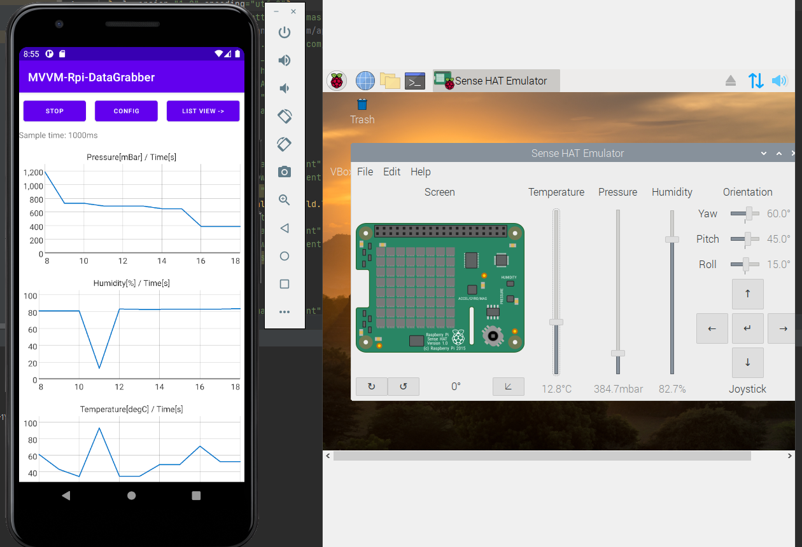

# MVVM-Rpi-DataGrabber
Android application designed to operate the Raspberry Pi and SenseHat.

## Introduction
This is University Project made to use the whole functionality that SenseHat delivers to user. The program exhibits data from all available sensors, and presents them in various ways. First view presents Graph Views taht show sensor data in real time and user can set parameters like sample time or server ip. Secound one provides the same functionality presented with Recycler View. Moreover, the application allows to control SenseHat's LED matrix by selecting single LED and customizing its color. Last utility provided by this application is to show current state of joystick.

### Attention
This application requires some server-side CGI scripts and Python code to handle SenseHat functionality witch is not a part of this repository.

## Technology 
Java, Android SDK, MVVM Patern, XML, RecyclerView, GraphView 

## Illustrations

